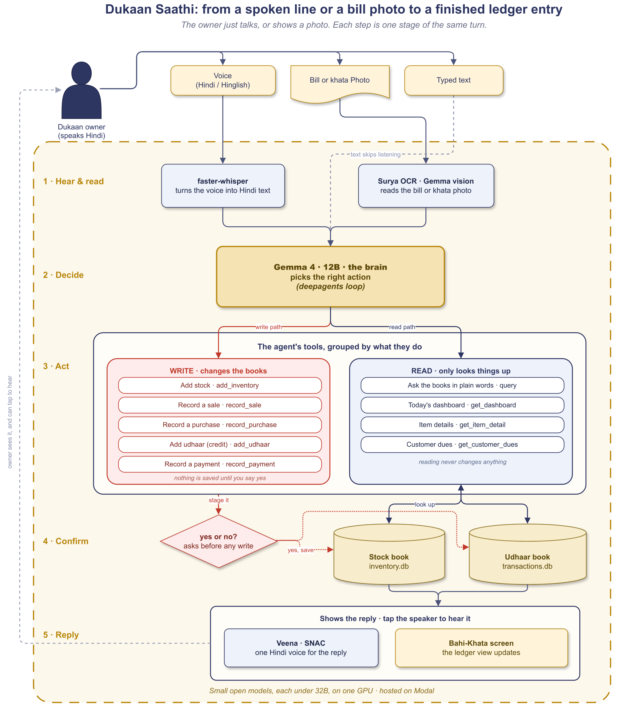

# Dukaan Saathi

A Hindi-first assistant for a small kirana (corner) shop. The owner just talks, or shows a photo of a bill, and the app keeps the two things that used to live on paper: the stock, and the *udhaar*, the running credit customers pay back later. It also watches the shelf, flags what is about to expire or is not selling, suggests a discount to clear slow stock, and reminds the owner to restock before a festival.

Built for the **Build Small Hackathon**, Backyard AI track. Everything runs on open-weight models, each well under 32B. For the demo those models are self-hosted on Modal, with no proprietary cloud AI anywhere in the loop.

- Live Space: https://huggingface.co/spaces/build-small-hackathon/dukaan-saathi
- Blog (Field Notes): https://build-small-hackathon-dukaan-saathi.hf.space/blog
- Demo video: https://www.loom.com/share/7a675a1918bf4233bd44c8e049f84c97
- Social post: https://x.com/ps_1506/status/2066625864482349310
- Code: https://github.com/PrathamSingla15/dukaan-saathi

## Architecture



One shopkeeper turn runs through five steps:

1. **Hear and read.** faster-whisper turns Hindi speech into text. For a bill or *khata* photo, Surya OCR does a first pass over the page, then Gemma reads it.
2. **Decide.** Gemma 4 (12B, with vision) runs as a deepagents loop and picks the right tool.
3. **Act.** Tools split in two: writes (add stock, record a sale, note credit, record a payment) and reads (the day's dashboard, a customer's dues, why an item is not moving).
4. **Confirm.** Anything that would write is read back as a yes/no question. Nothing is saved until the owner says yes.
5. **Reply.** The answer shows up in the Bahi-Khata ledger screen. When the owner taps the speaker, Veena (with a SNAC decoder) reads it back in one steady Hindi voice.

See [`design.md`](design.md) for the full design.

## What it does

- **Voice credit book.** *"Sharma ji ne 200 ka udhaar liya"* stages an entry; *"kiska kitna baaki hai?"* returns a ranked list of who owes what.
- **Receive stock by photo.** Hold up the supplier bill. The lines come into a table you can fix before anything is saved, with an estimated expiry when the bill prints none.
- **Expiry and FEFO.** Sells the oldest stock first and warns before items go off.
- **Festival nudges.** Restock reminders before demand jumps, not after.
- **"Why isn't X selling?"** Reasons over the sales trend, the stock, and the price, then gives a plain answer and a fix, such as a small clearance discount.
- **Polite reminders.** Drafts a Hindi collection message for overdue credit, and never sends it on its own.
- **Money at a glance.** Cost, price, and margin per item, the value of everything on the shelf, and the day's takings.

Two rails keep it safe: it never writes to the books without a yes, and it never sells stock the shop does not have.

## Stack (open-weight models, ≤32B)

| Layer | Choice |
|---|---|
| LLM + vision | **Gemma 4 (12B)**, Q4_K_M GGUF, via **llama.cpp** (`llama-server`, OpenAI-compatible `/v1`) |
| Bill OCR pre-pass | **Surya** |
| Agent | **deepagents** (LangChain) driving the local model |
| Speech to text | **faster-whisper** large-v3 (Hindi) |
| Text to speech | **Veena** (Hindi / Hinglish) with a **SNAC** decoder |
| Database | two **SQLite** files, `inventory.db` + `transactions.db`, read together via `ATTACH` |
| Frontend | custom **Gradio** "Bahi-Khata" single-screen app |

## Hosting (Modal + HF Space)

The Hugging Face Space runs the Gradio UI on CPU; all GPU work is on Modal, in one app (`dukaan-llm`, `scripts/modal_app.py`) split across two warm L4 GPUs so neither model starves:

- **GPU 1 (L4)** runs the LLM + vision/OCR: llama.cpp `llama-server` with Gemma 4 (12B) GGUF, served OpenAI-compatible at `/v1`.
- **GPU 2 (L4)** runs speech: faster-whisper for STT and Veena + SNAC for TTS, at `/stt` and `/tts`.

Both stay warm with `min_containers=1`. Deploy with `MODAL_PROFILE=projects-ps MIN_CONTAINERS=1 PYTHONPATH="$PWD" modal deploy scripts/modal_app.py`, then point the Space at the two URLs through the secrets `DUKAAN_LLM_BASE_URL` / `DUKAAN_STT_BASE_URL` / `DUKAAN_TTS_BASE_URL`, plus `HF_TOKEN` for the gated Veena weights.

A config-only swap to **MiniCPM-V 4.6** (≤4B) runs the same app on a smaller vision stack.

## Tracks and badges

| Badge | Evidence |
|---|---|
| 🏡 **Backyard AI** | A real kirana owner's daily problem: voice *udhaar*, bill OCR, expiry/FEFO, festival nudges, run on his own books (demo video). |
| 🟢 **Modal** | LLM + vision/OCR and STT + TTS hosted on Modal across two warm L4 GPUs (`scripts/modal_app.py`). |
| 🤖 **Best Agent** | deepagents loop, 10 read/write/vision tools, confirm-before-write, a visible tool-call trace under every reply. |
| 🎨 **Off-Brand** | Custom "Bahi-Khata" HTML/CSS/JS ledger UI with instant EN/हिं. |
| 🦙 **Llama Champion** | Runs on `llama.cpp` (`llama-server`). |
| 📓 **Field Notes** | Build write-up, served at `/blog` and linked above. |
| 📡 **Sharing-is-Caring** | Exported agent trace (`scripts/export_trace.py`). |
| 🎬 **Best Demo** | Real-owner Hindi demo (video linked above). |

## Evaluation

- **Headless suite:** `uv run pytest -q` gives 56 pass / 2 skip (LLM, STT, and vision mocked). It covers cross-DB integrity, FEFO lots, balances, the oversell guard, the tools, onboarding, and festival intent.
- **Real-model end-to-end:** `scripts/e2e_full.py` drives about 24 real Gemma turns over the seeded shop across 38 checks: tool routing (read vs write), ground-truth lookups, confirm-before-write, a FEFO sale, a quantity-merge restock, the oversell block, a vision bill receive, Hindi STT, TTS, the morning briefing, and the festival calendar.

## Team

- Pratham Singla ([@yobro4619](https://huggingface.co/yobro4619))
- Adesh Gupta ([@aadex](https://huggingface.co/aadex))
- Shivank Garg ([@shivank21](https://huggingface.co/shivank21))

## Quickstart (local dev)

```bash
uv sync
# Gemma GGUF + mmproj, Whisper, Veena + SNAC. Veena is gated: run `hf auth login` first.
bash scripts/download_models.sh
# build and seed the two demo databases
uv run python -m dukaan.db --reset
# UI at :7860, blog at :7860/blog
uv run python -m dukaan.app
```

For the hosted setup (Modal LLM + HF Space), see Hosting above.
