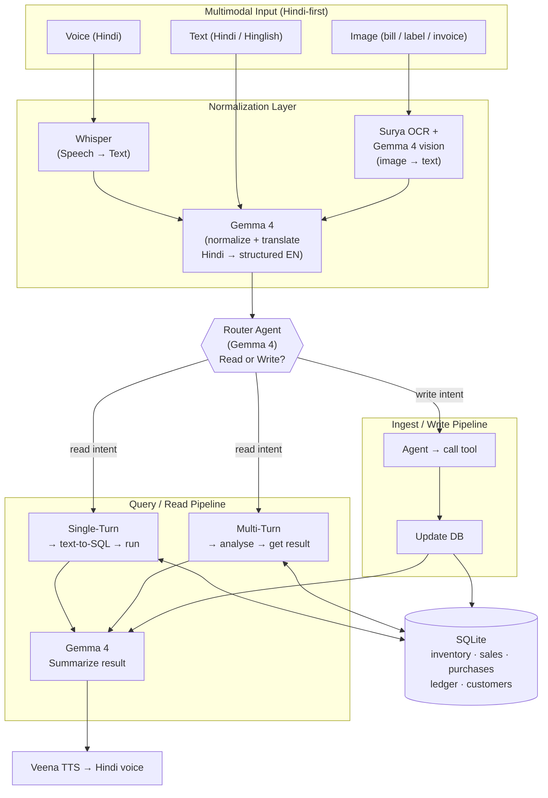
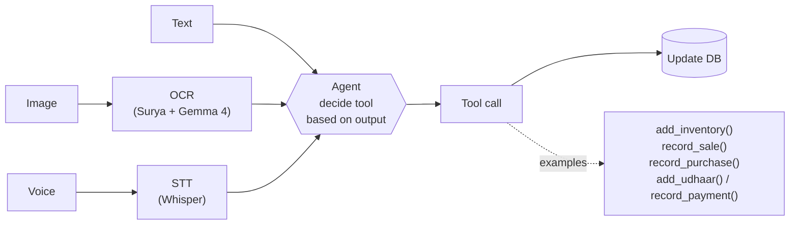
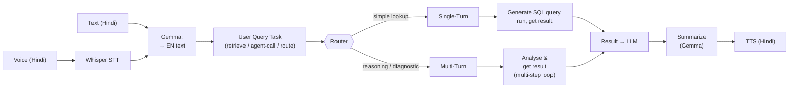
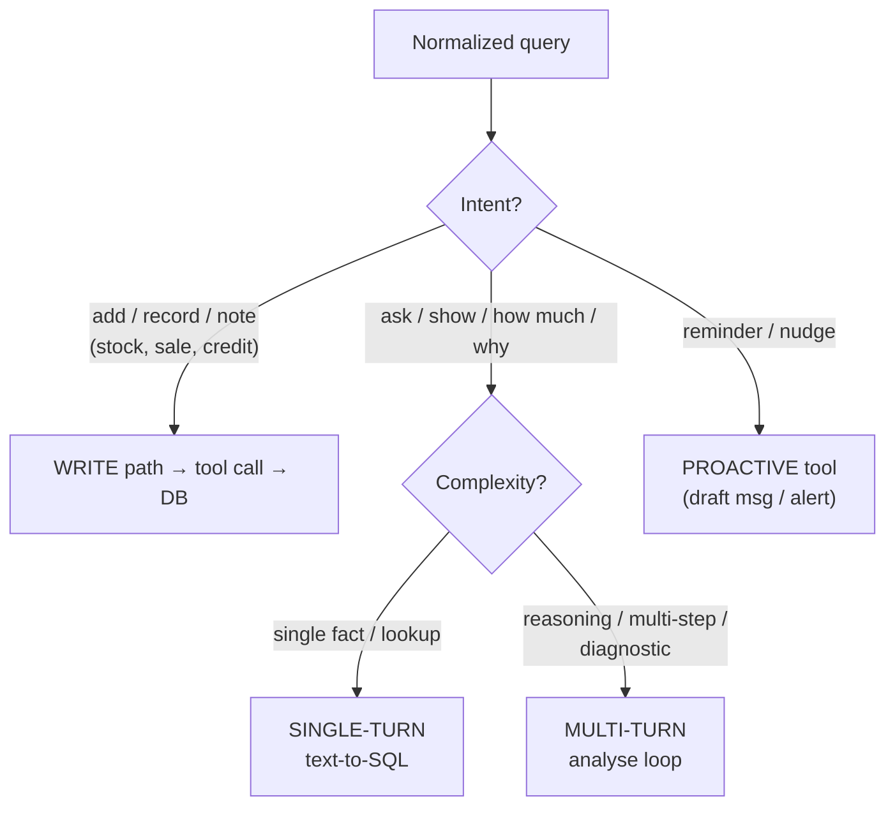
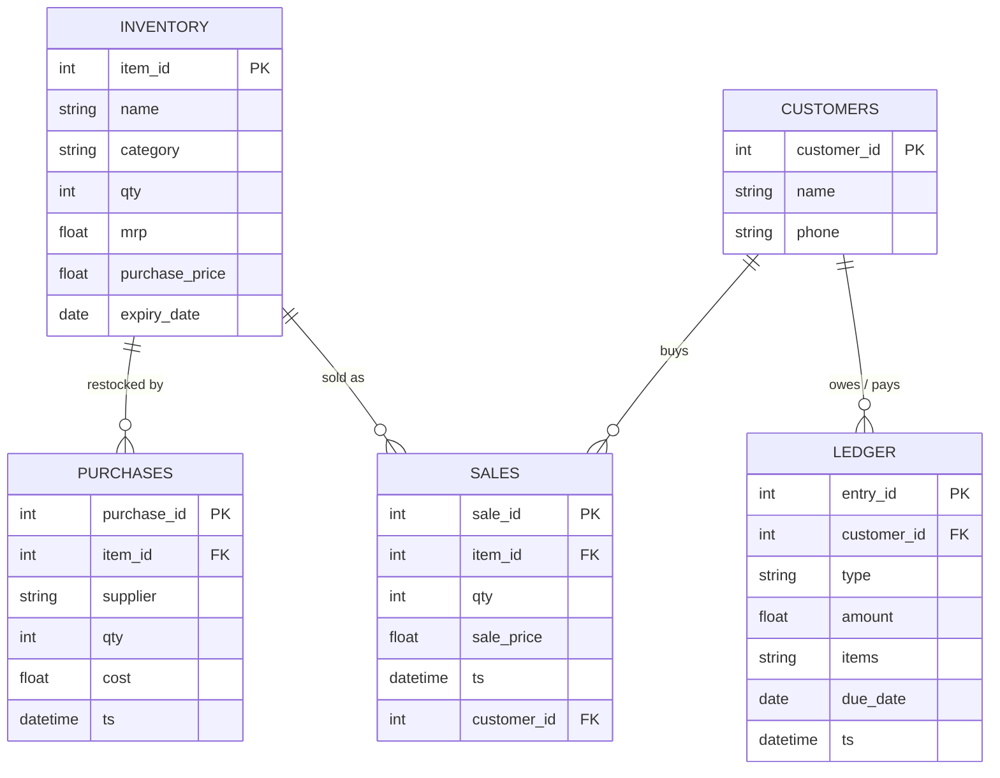
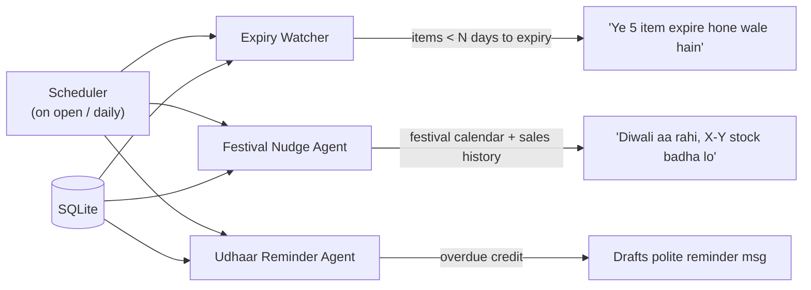

# Dukaan Saathi: System Architecture

> **Build Small Hackathon · Backyard AI track**
> A Hindi-first, voice-driven inventory + *udhaar* (credit) ledger assistant for a small kirana shop owner.
> *Small enough to run cheaply, big enough to change a shopkeeper's day.*

---

## 1. The person & the problem

**Persona:** A local kirana / general-store owner (e.g. *Ramesh bhaiya* down the street). Runs the shop solo, tracks stock and customer credit in a paper *bahi-khata*, is comfortable speaking Hindi but not typing English or using spreadsheets.

**Pain points it fixes:**
- Stock and *udhaar* live in a paper notebook, easy to lose, impossible to search.
- No idea what's about to **expire** or **isn't selling**.
- Forgets to **stock up before festivals** (demand spikes go unmet).
- Awkward / forgets to **chase customers for pending credit**.

**Interaction model:** He just **talks to the app in Hindi** (or snaps a photo of a bill / shows a label). Everything else is automatic.

---

## 2. High-level architecture

---

## 3. Write / Ingest flow  *(from whiteboard 2)*

Adding stock, recording a sale/purchase, or noting credit, by photo, text, or voice.

**Example:** *"10 Parle-G ke packet aaye, 5 rupaye wala, 100 piece"* → Whisper → Gemma extracts `{item: Parle-G, qty: 100, mrp: 5}` → agent calls `add_inventory()` → row written.

---

## 4. Read / Query flow  *(from whiteboard 1)*

- **Single-Turn** → one shot text-to-SQL on SQLite (e.g. *"aaj kitni biri hui?"* → `SELECT SUM(...) FROM sales WHERE date=today`).
- **Multi-Turn** → agentic loop that queries, reasons, re-queries (e.g. *"Maggi kyun nahi bik raha?"* → pulls sales trend, compares to last month, checks stock & expiry, reasons).

---

## 5. Router decision logic

---

## 6. Data model (SQLite, local, zero-infra)

> **Inventory = Selling + Purchase + MRP**, the three dimensions per item (`sale_price` via SALES, `purchase_price`/`cost` via PURCHASES, `mrp` on INVENTORY) so margin and stock value are always computable.

---

## 7. Proactive / scheduled agents

These run on a timer (or on app open), the assistant reaches out instead of waiting to be asked.

---

## 8. Feature → component mapping

| Feature | What it does | Components used |
|---|---|---|
| **Voice Credit Ledger** (*udhaar khata*) | Add/retrieve credit entries by voice, "Sharma ji ne 200 ka udhaar liya" / "kiska kitna baaki hai?" | Whisper → Gemma → `add_udhaar` / `record_payment` / query LEDGER |
| **Inventory + Expiry** | Track stock; flag items nearing expiry | INVENTORY table + Expiry Watcher agent |
| **Festival-aware stock-up nudge** | Reminds to restock before demand spikes | Festival calendar + sales history + Nudge agent |
| **"Why not selling?" diagnostic** | Reasons about slow movers | Multi-turn loop over SALES trends + stock + expiry |
| **Reminder-drafter** (*udhaar ke paise*) | Drafts a polite Hindi collection message | LEDGER overdue + Gemma drafting → WhatsApp/SMS text |
| **Selling / Purchase / MRP** | Margin & stock-value visibility per item | SALES + PURCHASES + INVENTORY.mrp |

---

## 9. Tech stack & small-model fit

| Layer | Choice | Why it fits "build small" |
|---|---|---|
| **Speech → Text** | **faster-whisper** large-v3 | Robust Hindi STT, no proprietary API |
| **LLM (route, text-to-SQL, summarize, draft)** | **Gemma 4** (12B), Q4_K_M GGUF, via llama.cpp | Open-weight, vision-capable, strong instruction following, well under 32B |
| **OCR / image understanding** | **Surya** OCR pre-pass + **Gemma 4** vision | Surya reads the page first, Gemma makes sense of messy or handwritten bills |
| **TTS (speak back)** | **Veena** (Hindi / Hinglish) + **SNAC** decoder | One steady Hindi voice for the reply |
| **Database** | **SQLite** (inventory + transactions) | Two files, zero infra, read together via `ATTACH` |
| **Agent / tools** | **deepagents** (LangChain) loop | Read + write + vision tools, confirm-before-write |
| **Frontend** | **Gradio** "Bahi-Khata" on a **HF Space** | Custom HTML/CSS/JS ledger UI; GPU work hosted on **Modal** |

**Honest constraint fit:** the whole stack (faster-whisper + Surya + Gemma 4 12B with vision + Veena + SQLite + Gradio) is open-weight and modest. For the demo it is self-hosted on Modal across two warm L4 GPUs, one for the LLM and vision, one for speech. Because the models are open, the same setup can run on a shop's own hardware. No giant model is doing anything a small one can't.

---

## 10. Judging-criteria alignment

- **Specific & real problem** → one named kirana owner, paper-ledger pain, Hindi voice barrier.
- **Person actually used it** → voice-first + photo input means he can use it with zero typing; demo by recording him adding stock and asking "kiska udhaar baaki hai?"
- **Honest small-model fit** → Gemma + Whisper chosen *because* small models are enough here, not despite it.
- **Gradio polish** → single clean screen: mic button, photo upload, chat/answer area, and a "today" dashboard (stock value, expiring soon, udhaar pending).
