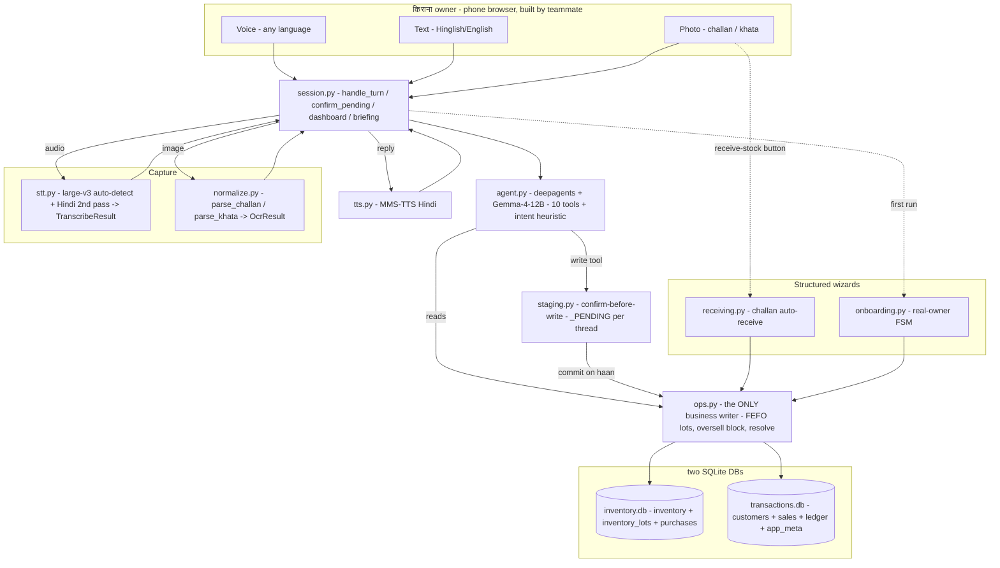
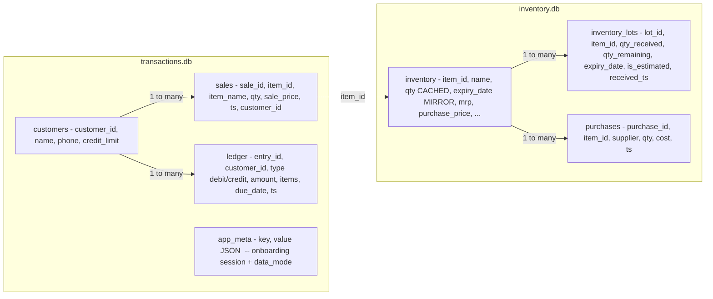
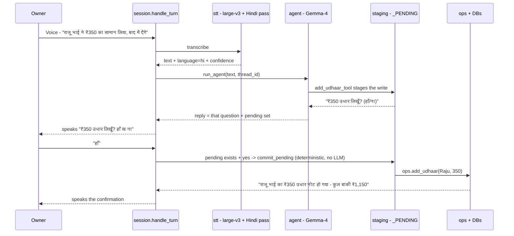
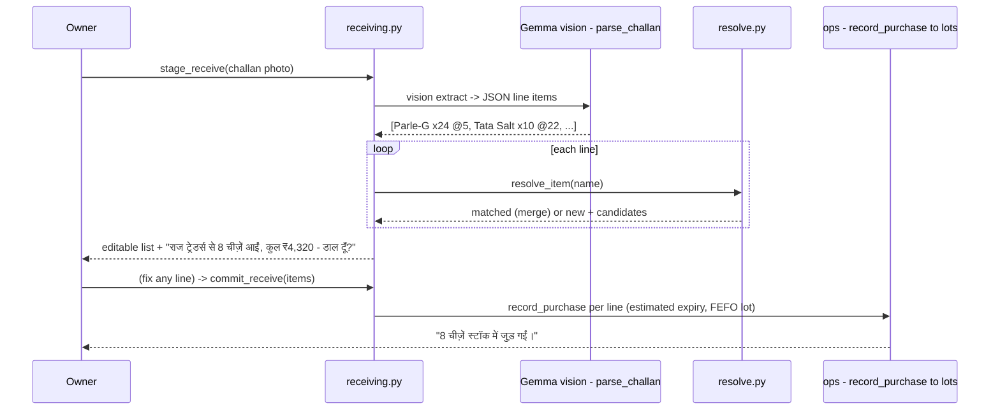
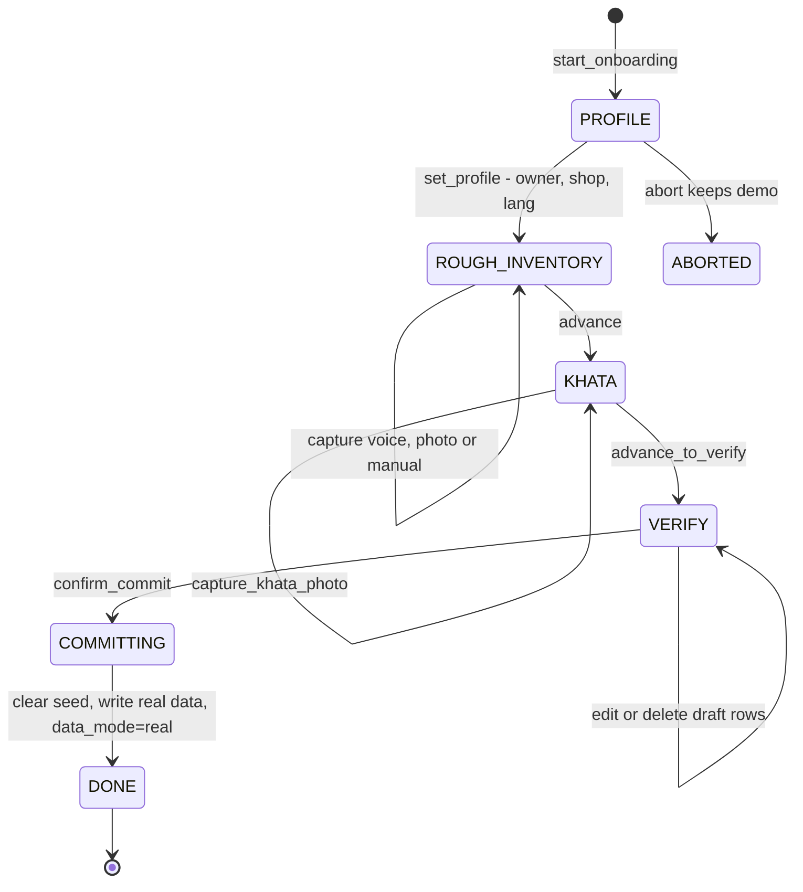

# Dukaan Saathi — Final Report (As‑Built After the Track‑1 Revision)

> **What this is.** The definitive end‑to‑end report of **Dukaan Saathi** after the Track‑1 revision was implemented — what the system is now, every component that changed, and exactly how a shopkeeper's turn flows through the stack today. It is the "as‑built" reference for the backend that ships to GitHub for the UI/Space build.
>
> **Status:** backend complete and verified — **59 headless tests pass** (LLM/STT/vision mocked) **+ 9/9 real‑model GPU end‑to‑end** on vitallab2. Replies are Hindi/Hinglish for now (multilingual reply is a documented future switch). No Gradio screens / Dockerfile / HF Space are built here — those are the teammate's next step, on top of the `session.py` seam documented in `INTERFACE.md`.

---

## Table of contents
1. [Executive summary](#1-executive-summary)
2. [What changed in this revision](#2-what-changed-in-this-revision)
3. [Revised system architecture](#3-revised-system-architecture)
4. [The data model — FEFO lots under a merged item](#4-the-data-model)
5. [End‑to‑end flows (how it works now)](#5-end-to-end-flows)
6. [Key subsystems](#6-key-subsystems)
7. [The backend ↔ UI seam](#7-the-backend--ui-seam)
8. [Verification — headless + real‑model](#8-verification)
9. [Configuration & operations](#9-configuration--operations)
10. [Deferred / future work](#10-deferred--future-work)
11. [Appendix — module inventory & commands](#11-appendix)

---

## 1. Executive summary

**Dukaan Saathi** is a Hindi‑first, voice + photo assistant that runs a kirana (corner) shop's **inventory and udhaar (credit) ledger** — fully local, no cloud APIs. The shopkeeper **speaks in any language, types in Hinglish/English, or snaps a photo of a challan (supplier bill) or khata (handwritten credit ledger)**; the assistant understands, acts, and replies in Hindi (voice + text).

The brain is unchanged — **Gemma‑4‑12B** (Q8_0 GGUF, vision‑capable) served by `llama.cpp` and driven by a **deepagents** (LangGraph) loop with a registry of LangChain tools, plus **faster‑whisper** STT and **MMS‑TTS** speech. The revision **did not change the model**; it made the product *real and safe*:

- a true **batch/expiry (FEFO)** stock model that matches how a kirana actually works,
- **robust quantity‑merge** so restocks never create duplicate rows,
- **multilingual speech** with a Hindi/rural second pass and **never‑empty** STT/OCR fallbacks,
- a **challan‑photo auto‑receive** flow and a **real‑owner onboarding** wizard (replace the demo seed with his real data),
- **confirm‑before‑write** safety + an **oversell hard‑block**, and a **calendar‑driven** festival nudge (no hardcoded dates),
- all wired behind one **UI‑agnostic seam** (`session.py`) so a teammate can build the Gradio UI + Hugging Face Space without touching backend logic.

Everything below is verified against the running code (59 headless tests + a real‑Gemma GPU end‑to‑end of 9/9 checks).

---

## 2. What changed in this revision

Each owner requirement from the planning session, mapped to what shipped:

| # | Owner requirement | Delivered |
|---|---|---|
| 1 | Three inputs: **voice (any language)**, text (Hinglish/English), photo of **challan / khata** | `session.handle_turn(audio\|text\|image)`; STT auto‑detects language; challan vs khata have separate vision prompts (`parse_challan` / `parse_khata`). |
| 2 | **Fallbacks must never be empty** — ask to repeat in the user's language; confirm the name if ambiguous | Structured `TranscribeResult` / `OcrResult`; low‑confidence/empty STT → "please repeat"; OCR fail → "re‑upload"; ambiguous item/customer → "kaun sa?" with candidates. |
| 3 | **No hardcoded festivals** — real calendar for 2026+ | `proactive.py` uses `holidays.India` (public+optional) + a small bundled `festival_overrides.json`. Works 2026 **and** 2027+. |
| 4 | **Don't build the HF‑Space UI** — teammate does it after GitHub | Backend modules + `session.py` seam + `INTERFACE.md`. `app.py` is a thin shell. No Dockerfile/Space. |
| 5 | **Merge quantity, don't duplicate** an existing item | `resolve.py` (rapidfuzz + difflib, brand/size aware) merges name variants into the existing row. |
| 6 | Switch to an **Indian‑voice STT** model | Kept `large‑v3` for multilingual auto‑detect **+ a Hindi/rural fine‑tune second pass** (`vasista22` ct2‑int8) when Hindi is detected. |
| 7 | **Real‑impact onboarding** — rough inventory (owner won't know exact counts) + challan tracking; **expiry** even though challans omit it; khata photos → **verify** the data | `onboarding.py` FSM; **FEFO `inventory_lots`** with shelf‑life **expiry estimation**; khata → verify‑back table → commit. |
| 8 | Already‑present item + more qty ⇒ **update the same row** | The lots layer adds a batch and recomputes `inventory.qty`; the owner still sees **one merged row** per item. |

Two safety items from the revision blueprint also landed: **confirm‑before‑write** (a spoken "haan/nahi" before any DB mutation) and an **oversell hard‑block** (can't sell more than is in stock). The redundant per‑turn intent LLM call was removed (now a pure heuristic).

---

## 3. Revised system architecture

A shopkeeper turn enters through one UI‑agnostic function (`session.handle_turn`) and fans out to capture (STT/OCR), the agent loop, the staging/confirm gate, and the two‑database ops layer — then returns a structured `TurnResult` (text + optional Hindi audio + dashboard snapshot).

**Layering (new modules in bold).** Capture: `stt.py`, `normalize.py`, `llm.vision_extract`. Helpers: **`shelf_life.py`**, **`resolve.py`**, **`i18n.py`**. Data/ops: `db.py` (+ `inventory_lots`, `app_meta`), `ops.py` (the sole business writer). Confirm: **`staging.py`** + the wizards **`receiving.py`** / **`onboarding.py`**. Agent: `agent.py`, `tools.py`. Orchestration: **`session.py`**. Proactive: `proactive.py`. The whole thing is **import‑light** — no model load or network at import time.

### Before → after

| Dimension | Before | After (this revision) |
|---|---|---|
| Stock/expiry | one `expiry_date` per item; restock overwrote it | **FEFO `inventory_lots`**; `inventory.qty` = cached SUM(lots); earliest‑expiry first |
| Quantity merge | fuzzy `LIKE`, variant names made duplicate rows | **`resolve.py`** scored match → merges variants; ambiguity asks "kaun sa?" |
| STT | `large‑v3`, language hardcoded `hi`, bare string | **auto‑detect + Hindi 2nd pass**, structured `TranscribeResult`, confidence‑gated |
| OCR | generic prompt, returned `""` on failure (silent) | **challan/khata prompts**, structured result, **never‑empty** re‑upload fallback |
| Writes | committed immediately; oversell only warned | **confirm‑before‑write** + **oversell hard‑block** |
| Onboarding | none (synthetic seed only) | **real‑owner FSM** (rough inventory + khata → verify → replace seed) |
| Festivals | 14 hardcoded 2026 dates | **`holidays.India` + overrides** (any year) |
| Intent badge | extra LLM call per turn | **pure heuristic** over tool calls (0 extra calls) |
| Entry point | logic inside the Gradio callback | **`session.py`** seam; `app.py` is a thin adapter |

---

## 4. The data model

Two SQLite databases (writes route to the owner; reads `ATTACH` both as `inv` / `txn` so the agent's SQL can JOIN across them, behind a read‑only SELECT guard). The revision adds **`inventory_lots`** (FEFO batches) and **`app_meta`** (onboarding session + demo/real flag).

**The key idea — one merged row, batches underneath.** The owner (and every existing query/dashboard) still sees **one `inventory` row per item** with a running total. Underneath, each receipt with a distinct expiry is a **lot**:

- `inventory.qty` is a **cached `SUM(open lots.qty_remaining)`** and `inventory.expiry_date` **mirrors the earliest open lot** — so legacy reads and the LLM's SQL keep working unchanged.
- A single function, `ops._recompute_item_qty()`, is the **only writer of `inventory.qty`** — the cache can never drift (asserted in tests: zero drift across all 160 seeded items).
- **Restock** adds‑or‑merges a lot (merge only when `item_id` + `expiry_date` + `is_estimated` all match — a new batch never clobbers an older batch's expiry).
- **Sale** drains **earliest‑expiry lots first** (FEFO; NULL‑expiry/non‑perishables last), then recomputes the cache.
- **Challans omit expiry**, so it is **estimated** as `received_date + shelf_life_days` (from a per‑SKU/category shelf‑life table) and flagged `is_estimated=1` (the UI shows "anumanit/approx").

A one‑time idempotent migration (`db.backfill_lots()`, run inside `init_db`) gives every existing item exactly one lot, so old data and a fresh seed both work.

---

## 5. End‑to‑end flows

### 5.1 Voice udhaar with confirm‑before‑write (the hero loop)

Nothing is written until the owner says **haan**. The write tool *stages* and returns the question; the commit is resolved deterministically.

The confirm turn does **not** depend on the model: once a write is staged for a thread, a plain "haan/nahi" through `handle_turn` is resolved directly by `staging.commit_pending` / `clear_pending`.

### 5.2 Challan photo → auto‑receive stock

`stage_receive` is **read‑only** (parse + resolve + estimate, nothing written); `commit_receive` is the only write and goes through the same FEFO lots path, so a re‑arriving item merges into its existing row.

### 5.3 Real‑owner onboarding (replace the demo seed with real data)

A deterministic finite state machine; nothing touches the real tables until the owner reviews the verify‑back table and confirms. On commit, the synthetic seed is cleared and `data_mode` flips `demo → real`.

The owner does **not** need exact counts — he gives a *rough* picture of the main goods (by voice or photo); ongoing **challan scanning** then fills in exact quantities, prices and (estimated) expiry over time. Khata pages are OCR'd into customers + opening balances and shown back for correction before any write.

### 5.4 Dashboard & morning briefing

`session.dashboard_snapshot_struct()` returns stock value, today's sales, **lots‑aware** expiry alerts (with "approx" flags), low stock, pending udhaar, slow movers, the next festival, and a `server_up` flag — best‑effort so one failing piece never sinks the panel. `session.morning_briefing()` rolls the proactive checks (expiry + overdue‑udhaar drafts + festival) into a short spoken Hindi "subah ka haal".

### 5.5 Multilingual input & never‑empty fallbacks

STT auto‑detects the language; on Hindi with high confidence it re‑transcribes with the Hindi/rural fine‑tune for accuracy. If speech is empty/low‑confidence, the owner is asked to repeat (in Hindi/Hinglish for now) — the agent is **not** called with empty input. If a photo can't be read, the reply is a clear "re‑upload a clearer photo," never a blank turn. Ambiguous entities ("which Sharma?", "which Parle‑G pack?") return a numbered choice instead of silently guessing.

---

## 6. Key subsystems

- **STT (`stt.py`).** faster‑whisper `large‑v3`, `language=None` → auto‑detect; harvests `info.language` / `language_probability` and per‑segment `no_speech_prob` for a confidence‑gated, structured `TranscribeResult`. Optional **Hindi 2nd pass** (`digikar/vasista22‑whisper‑hindi‑large‑v2‑ct2‑int8`, Apache‑2.0, downloaded once) triggers when Hindi is detected ≥0.80 confidence; it degrades gracefully to `large‑v3` if absent.
- **OCR / vision (`normalize.py` + `llm.vision_extract`).** Document‑specific prompts for **challan** (→ JSON line items) and **khata** (→ JSON customers + balances), with a salvage JSON parser for small‑model output and never‑empty results.
- **FEFO / expiry (`ops.py` + `shelf_life.py`).** `_add_lot` (create‑or‑merge), `_consume_fefo` (earliest‑first drain), `_recompute_item_qty` (sole cache writer), `expiring_lots` (earliest open lot per item), `estimate_expiry` (shelf‑life lookup from the seed catalog's per‑SKU `shelf_life_days`).
- **Resolver / dedup (`resolve.py`).** Name normalization (strip price/pack/unit tokens, isolate brand+base), scored matching (exact > HSN > brand+base via `rapidfuzz.token_set_ratio`, `difflib` fallback), verdict `matched` / `ambiguous` / `none`. `ops` falls back to exact‑name match on non‑`matched` so an exact restock name still merges (no duplicate).
- **Confirm gate (`staging.py`).** Per‑thread `_PENDING` batch; write tools stage instead of writing; `commit_pending` dispatches to the real `ops.*` writers (the only place staged writes land). Thread is bound process‑globally by `run_agent` right before invoke (a `ContextVar` was invisible inside deepagents' copied tool context — a bug a real‑model run caught).
- **Festival calendar (`proactive.py`).** `holidays.India(years=[this, next], categories=("public","optional"))` for dates (handles Dec→Jan rollover) + `festival_overrides.json` for the gaps (Karwa Chauth) and the per‑festival kirana stock hints; fully offline.
- **Intent heuristic (`agent.py`).** `_intent_from_tool_calls` maps the tools used this turn → a write/lookup/chat badge with **zero** extra LLM calls (the old per‑turn classifier call was removed).

---

## 7. The backend ↔ UI seam

The teammate's Gradio UI (and the future HF Space) import **only** `dukaan.session`, `dukaan.onboarding`, and `dukaan.receiving` — never `stt`/`agent`/`ops` directly — and render the returned dataclasses/dicts. The full contract is in **`INTERFACE.md`**. The core surface:

- `session.handle_turn(*, audio, text, image, thread_id, tts, mode) -> TurnResult` — one conversational turn.
- `session.confirm_pending(answer, *, thread_id, tts) -> TurnResult` — the yes/no buttons.
- `session.dashboard_snapshot_struct()` and `session.morning_briefing(tts=False)`.
- `onboarding.*` — the first‑run wizard (step views + verify table).
- `receiving.stage_receive(...)` / `receiving.commit_receive(...)` — the challan 3‑call contract.

`TurnResult` carries everything the UI needs: `reply_text`, `reply_audio`, `detected_language`, `pending_confirmation`, `clarification`, `needs_reupload`, `dashboard_snapshot`, `intent_badge`, `tool_calls`, `user_text`, `error` (and a JSON‑able `to_dict()`). Every model path, DB path, and language knob is env‑driven, so the Space needs **zero** backend edits — point `DUKAAN_DATA_DIR` at the Space's `/data` persistent volume and the two SQLite DBs + onboarding survive restarts.

---

## 8. Verification

**Headless suite — 59 passed, 2 skipped** (the 2 are the GPU‑gated e2e). LLM/STT/vision are mocked so it runs with no GPU/server:

| Area | File | What it proves |
|---|---|---|
| FEFO lots | `test_lots_fefo.py` (6) | backfill 1 lot/item, qty=SUM(lots) zero drift, earliest‑first drain, same‑expiry merge, oversell block, estimate |
| Dedup | `test_resolve.py` (4) | exact match=100, variant merges (no dup row), new ≠ matched, candidates |
| Challan | `test_receiving.py` (4) | merge/new classification, stage read‑only, commit via lots, re‑upload on bad image |
| Onboarding | `test_onboarding.py` (4) | full flow replaces seed (demo→real), never‑empty voice/khata fallbacks, abort keeps demo |
| Seam | `test_session.py` (5) + `test_session_confirm.py` (1) | text turn, STT‑empty fallback (no agent call), OCR re‑upload, confirm commits, deterministic yes/no, JSON‑able |
| Festivals + intent | `test_festival_intent.py` (6) | Diwali/Karwa Chauth 2026, works in 2027, intent mappings, keyword fallback |
| Original regressions | `test_ops/db/tools/numwords` | analytics, two‑DB integrity, tool registry, number‑words — all still green |

**Real‑model GPU end‑to‑end — 9/9 passed** (`sbatch scripts/e2e_gpu.sbatch`, Slurm job 1327, `rc=0`): starts `llama-server`, then exercises the real stack:

- `agent_lookup` → *"आज की कुल बिक्री ₹7,205 हुई है…"* (real Gemma, Devanagari, intent=lookup) ✓
- `write_staged_not_committed` → real Gemma called `add_udhaar_tool` → *"…₹100 udhaar — likh dun? (haan/nahi)"*, balance still 0 ✓
- `confirm_commits_udhaar` → after "haan", balance 0 → 100 ✓
- `vision_parse_challan` → 3 lines, supplier "RAJ TRADERS"; `receiving_stage` → *"RAJ TRADERS se 3 cheezein aayi, kul ₹652 — daal du…"* ✓
- `stt_roundtrip` → TTS→STT detected `hi` at conf 1.00 ✓

> **Two bugs the mocks could not catch, fixed via the real run:** (1) deepagents/LangGraph hides a `ContextVar` bind from tool execution → the confirm‑staging thread is now a **process global** set before invoke; (2) the system prompt made the small model *pre‑ask* ("likh du?") instead of calling the write tool → reworded so it **calls the tool immediately** (calling is safe — the tool stages). Lesson recorded: always run one live‑agent e2e for tool‑state plumbing.

---

## 9. Configuration & operations

All behaviour is env‑overridable (see `dukaan/config.py`). The knobs that matter for deployment:

| Env var | Default | Purpose |
|---|---|---|
| `DUKAAN_DATA_DIR` | `./data` | point at the Space `/data` volume so both DBs + onboarding persist |
| `DUKAAN_LLM_BASE_URL` / `_MODEL` | `127.0.0.1:8080/v1` | llama‑server endpoint |
| `DUKAAN_WHISPER_MODEL` | `large-v3` | primary STT |
| `DUKAAN_STT_LANGUAGE` | `""` (auto) | `""` = multilingual auto‑detect |
| `DUKAAN_STT_HINDI_MODEL` | `vasista22…ct2-int8` | Hindi 2nd‑pass model (one‑time download) |
| `DUKAAN_CONFIRM_WRITES` | `true` | confirm‑before‑write on/off |
| `DUKAAN_REPLY_LANG_MODE` | `hindi_only` | reply language (seam for future multilingual) |

**Run locally:** `bash scripts/serve_llm.sh` (GPU llama‑server) · `uv run python -m dukaan.app` (the shell app) · `uv run python -m pytest` (suite). **GPU work on vitallab2 goes through Slurm** — `sbatch scripts/run.sbatch` (full app) or `sbatch scripts/e2e_gpu.sbatch` (the e2e proof). The demo seed is the fallback dataset; `db.data_mode()` reports `demo` vs `real`.

---

## 10. Deferred / future work

Honest, out of this revision's scope (the backend is intentionally lean):

- **UI + HF Space** — the teammate builds the Gradio screens, branding, cold‑start UX, `Dockerfile`, and Space config on the `session.py` seam.
- **Multilingual reply / TTS** — input is multilingual today; *replies* stay Hindi/Hinglish. The seam (`detected_language`, `reply_language`, `DUKAAN_REPLY_LANG_MODE`, per‑language TTS hook) is in place to switch on later.
- **Conversational challan‑in‑chat tool** — the wizard (`receiving.py`) is the deliverable; an agent tool to receive a bill mid‑conversation is a small future add.
- **One‑call morning briefing** — functional today; can be optimised to a single templated LLM call.
- **WhatsApp send, atomic cross‑DB writes** — drafts/compensating‑rollback exist; live send + WAL are future.

---

## 11. Appendix

**New modules this revision:** `shelf_life.py`, `resolve.py`, `i18n.py`, `staging.py`, `receiving.py`, `onboarding.py`, `session.py`, plus `dukaan/data/festival_overrides.json`. **Heavily revised:** `db.py` (lots/app_meta/migration), `ops.py` (FEFO/oversell/resolve), `stt.py`, `normalize.py`, `tools.py`, `agent.py`, `proactive.py`, `config.py`, `app.py` (thin adapter). 22 modules, ~6,300 lines.

**Tests:** 7 new files (lots, resolve, receiving, onboarding, session, session‑confirm, festival‑intent) + the original 5; 59 pass headless, 9/9 on GPU.

**Handoff doc:** `INTERFACE.md` (root) — the complete UI/Space integration contract.

---

*End of report. Backend complete and verified; ready to push to GitHub for the UI + Hugging Face Space build.*
