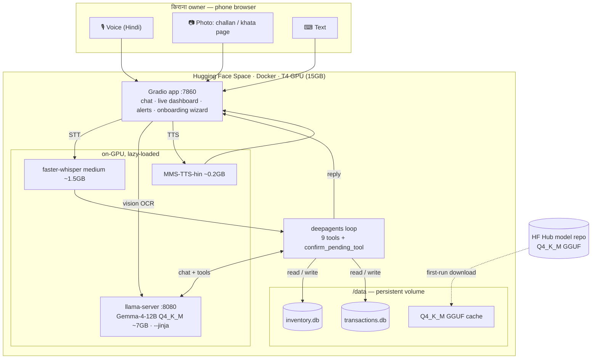
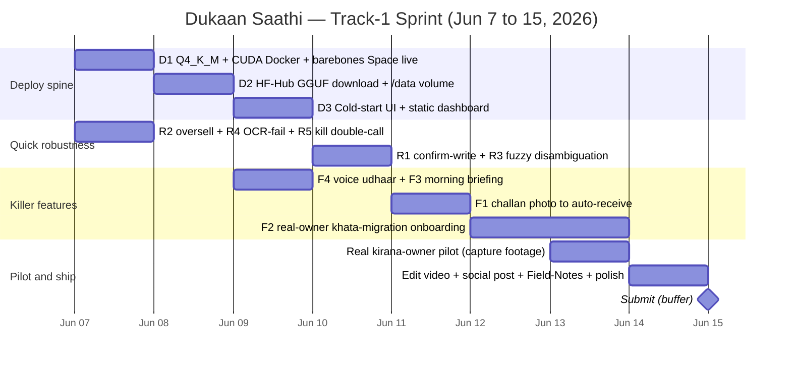

# Dukaan Saathi — Revision Architecture (Track‑1 Win Plan)

> **Purpose of this document.** A win‑focused architecture revision for the **Hugging Face × Gradio "Build Small" Hackathon — Track 1 "Backyard AI"** (deadline **2026‑06‑15**, ~8 days out). It explains *what the hackathon actually rewards*, where the current build stands, and the **exact, prioritized changes** that convert today's working-but-cluster-bound prototype into a *submittable, judge‑winning* Hugging Face Space.
>
> **Scope:** design/architecture only — **no implementation here** (per instruction). This is the blueprint we build from next.
> **Method:** produced from a multi‑agent brainstorm (6 idea lenses → 3 scoring judges → adversarial skeptic over **52 candidates**) grounded in a code deep‑dive and live hackathon research. See [Appendix B](#appendix-b--how-this-blueprint-was-produced).
> **Status of inputs:** the current codebase works end‑to‑end (31 tests pass, live demo, 28‑page as‑built report). Code anchors in this doc are verified against the repo.

---

## Table of contents
1. [TL;DR — the win thesis](#1-tldr--the-win-thesis)
2. [The hackathon, decoded (prizes · domains · rubric)](#2-the-hackathon-decoded)
3. [Where we stand today (as‑built + honest gap audit)](#3-where-we-stand-today)
4. [How Track‑1 is actually scored — our move per axis](#4-how-track1-is-actually-scored--our-move-per-axis)
5. [Revised target architecture](#5-revised-target-architecture)
6. [The 4 killer features](#6-the-4-killer-features)
7. [Must‑fix: deployability + robustness](#7-mustfix-deployability--robustness)
8. [Real‑owner pilot & adoption plan (the centrepiece)](#8-realowner-pilot--adoption-plan)
9. [Deployment plan — Gemma‑12B on a HF Space](#9-deployment-plan--gemma12b-on-a-hf-space)
10. [8‑day execution sequence](#10-8day-execution-sequence)
11. [Prize & badge strategy (decide‑later swings)](#11-prize--badge-strategy)
12. [Risks & mitigations](#12-risks--mitigations)
13. [Explicitly deferred (out of scope for 8 days)](#13-explicitly-deferred)
14. [Appendices](#14-appendices)

---

## 1. TL;DR — the win thesis

**Dukaan Saathi** is a Hindi‑first, voice + photo assistant that runs a kirana shop's **inventory and udhaar (credit) ledger** — fully local, no cloud APIs. It is an almost‑perfect fit for **Track‑1 "Backyard AI"**, whose literal pitch is *"solve a real problem for… a small‑business owner on your street."*

The build already exists and works. **It is not yet a Hugging Face Space, and it has never been used by a real shopkeeper** — and those two facts are exactly what Track‑1 scores hardest. So the revision is deliberately narrow:

> **Win thesis:** Ship one **deployable HF Space** running the *unchanged* Gemma‑4‑12B brain, put it in the hands of **one real kirana owner with his own data**, and land **one killer feature on each of the four judging axes** — filmed as a tight Hindi demo. Everything else is cut.

Four killer features, one per axis; one deploy spine that makes the hard "live Space" rule real; a handful of small robustness fixes so nothing breaks on camera. **~50 focused hours over 8 days**, sequenced deploy‑first so a valid submission exists from Day 2.

---

## 2. The hackathon, decoded

*Source: <https://huggingface.co/build-small-hackathon> (researched 2026‑06‑07). The registration page is login‑gated, so exact eligibility/team‑size/licence are unconfirmed — verify on the Hub.*

### 2.1 Format & hard rules
- **Host:** Hugging Face × Gradio. **Sponsors:** OpenBMB, OpenAI, NVIDIA, Modal, Cohere, JetBrains, Black Forest Labs.
- **Timeline:** build window **Jun 5 → submission Jun 15, 2026**.
- **Three hard rules (non‑negotiable):**
  1. **Model ≤ 32B total parameters.** *(Gemma‑4‑12B is comfortably under.)*
  2. **Must be a Gradio app hosted as a Hugging Face Space.** *(We are not on a Space yet — this is the #1 gap.)*
  3. **Submission = Space link + short demo video + social‑media post.**

### 2.2 The two tracks — we target Track 1
| Track | Pitch | Our fit |
|---|---|---|
| **1 — Backyard AI** | *"Solve a real problem for someone you actually know — a neighbour, a parent, a small‑business owner on your street."* | **Bullseye.** A kirana owner is the textbook user. |
| 2 — Thousand Token Wood | Whimsical/delightful AI toys & experiences. | Not our lane. |

### 2.3 Track‑1 judging rubric (4 axes, unweighted)
| # | Axis (exact wording) | What it means for us |
|---|---|---|
| **A** | *"Problem is specific and real"* | A named kirana owner; daily pains (challans, udhaar, stockouts) — not a generic SaaS. |
| **B** | *"The person actually used it"* | **Real adoption is scored.** Needs his *real data* in the app + evidence he used it. |
| **C** | *"Honest fit between problem and the small‑model constraint"* | Don't look like we over‑reached. Make the 12B's work *visibly necessary* (vision OCR, agentic reasoning) and document the efficiency story. |
| **D** | *"Polish of the Gradio app"* | A professional, fast, branded app — no spinners, no crashes on camera. |

### 2.4 Prize & badge map (~$48k, 29 awards)
| Category | Award | Relevant to us? |
|---|---|---|
| Per‑track | 1st **$4k** · 2nd $2.5k · 3rd $1.5k · 4th $1k | **Primary target (Track‑1 podium).** |
| Community Choice | $2k | Helped by a great demo video + social post. |
| **Best Agent** | **$1k** | **Strong fit** — multi‑tool agentic writes/reads. |
| Tiny Titan (≤4B) | $1.5k | ✗ *Not pursued — we keep 12B (locked decision). Documented trade‑off.* |
| Off‑Brand (custom UI) | $1.5k | *Decide‑later* — cheap CSS skin pass only. |
| Best Demo | $1k | The mandatory video, done well. |
| Sponsor: OpenBMB (MiniCPM) | $10k | ✗ *Would require a model swap — out of scope.* |
| Sponsor: OpenAI / NVIDIA / others | $10k / 2× RTX 5080 / … | ✗ *Require their models — out of scope.* |

**Six bonus badges** (more badges → Bonus‑Quest Champion $2k):

| Badge | Condition | Status |
|---|---|---|
| **Off‑the‑Grid** | No cloud APIs | ✅ **Already won** (fully local). |
| **Llama‑Champion** | Runs via llama.cpp | ✅ **Already won.** |
| **Field‑Notes** | Wrote a report/blog | ✅ **Already won** (28‑page as‑built report). |
| Sharing‑is‑Caring | Publish agent traces | *Decide‑later* (trivial JSONL dump). |
| Off‑Brand | Custom UI | *Decide‑later* (CSS skin). |
| Well‑Tuned | Publish a fine‑tune | ✗ Deferred (≈22h, separate project). |

> **Headline:** we already hold 3 badges and fit Best Agent **for free**. The whole game is now **rules‑compliance (live Space)** + **the four axes**.

---

## 3. Where we stand today

### 3.1 As‑built (works, verified)
- **Brain:** Gemma‑4‑12B‑it **Q8_0** GGUF + mmproj, served by CUDA `llama.cpp` `llama-server` (`--jinja`, thinking‑mode disabled). One model does **text + vision OCR**.
- **Agent:** deepagents 0.6.8 (LangGraph) + `ChatOpenAI` instance; **9 LangChain tools**; multi‑turn memory (`InMemorySaver` + `thread_id`); Hindi system prompt → Devanagari replies.
- **Data:** **two SQLite DBs** — `inventory.db` (suppliers/inventory/purchases) + `transactions.db` (customers/sales/ledger); reads `ATTACH` both read‑only (`inv.`/`txn.`) for cross‑DB JOINs; 2‑layer SELECT guard. Seeded with **synthetic** 160 SKUs / 35 customers / 120‑day history.
- **Speech & vision:** faster‑whisper `large‑v3` (Hindi STT, no system ffmpeg); `facebook/mms‑tts‑hin` TTS (+ `numwords` digit→Hindi); Gemma vision OCR.
- **Proactive:** expiry watcher · udhaar reminder (LLM‑drafted) · festival nudge (hardcoded 2026).
- **UI:** single‑screen Gradio 6.16 (mic/photo/text + chat + live dashboard + alerts).
- **Deploy:** **Slurm GPU job on a cluster** — *not a HF Space.*

### 3.2 Honest gap audit (what would lose points)
| Gap | Where | Axis at risk |
|---|---|---|
| **Not a HF Space** | no `Dockerfile`/Space config exists | **Rule 2 (invalid submission)** |
| **Synthetic data only** | `seed_*.py` | **B** (no real adoption) |
| Writes commit with **no confirmation**; **oversell allowed** | `ops.record_sale` → `new_qty<0` only warns (`ops.py:146`) | B, D (on‑camera risk) |
| **Ambiguous fuzzy match** picks first row silently | `ops.find_item`/`find_customer` | A, B (wrong‑customer udhaar) |
| **Silent OCR failure** → empty agent context | `normalize.ocr_image` returns `""` (`normalize.py:48`) | D (blank reply after photo) |
| **Double LLM call per turn** (intent badge) | `classify_intent`→`llm.complete` (`agent.py:207`) | C, D (waste + latency) |
| **Slow alerts** — N sequential LLM calls | `proactive.run_all` (`proactive.py:232`) | D (sluggish demo) |
| Volatile chat memory; hardcoded festivals; no auth | various | minor (accept for pilot) |

---

## 4. How Track‑1 is actually scored — our move per axis

> The skeptic's framing: *"Track‑1 is won on the four axes, not feature count."* So we map **one killer feature to each axis** and let the deploy spine satisfy the hard rule.

| Axis | Our primary move | Backed by |
|---|---|---|
| **A — specific & real** | **Challan‑photo → auto‑receive stock.** Distributor challans are a *daily* kirana ritual; doing it by photo is unmistakably real. | Killer #1 |
| **B — actually used it** | **Real‑owner "khata migration" onboarding** → his real stock/customers in the app + a filmed pilot. | Killer #2 + §8 |
| **C — honest small‑model fit** | The 12B is *visibly earning its size*: structured vision extraction from noisy Indian bills + multi‑tool agentic reasoning. Plus a documented Q4 efficiency story. | Killer #1 + §9 |
| **D — Gradio polish** | One‑tap **morning briefing** (single fast call), no cold‑start spinner, confirm‑before‑write, branded skin. | Killer #3 + §7 |

---

## 5. Revised target architecture

**Nothing about the brain changes.** We keep Gemma‑4‑12B, deepagents, the two‑DB design, Whisper, and MMS‑TTS. The revision **repackages** the working stack as a self‑contained, GPU‑backed **Docker Space**, adds a **persistent `/data` volume**, a **confirm‑before‑write** safety node, and four user‑facing capabilities.

### Before → after
| Dimension | Today (as‑built) | Revision (target) |
|---|---|---|
| Hosting | Slurm cluster job | **HF Space (Docker, T4 GPU)** |
| Model weights | Q8_0 (12 GB) | **Q4_K_M (~7 GB)** — fits T4 with headroom |
| STT | Whisper `large‑v3` | **Whisper `medium`** (env‑switchable) for VRAM budget |
| Data | synthetic seed | **real owner's data** via onboarding; persisted on `/data` |
| Writes | commit immediately | **confirm‑before‑write** (`_PENDING` + `confirm_pending_tool`) |
| Oversell | allowed (warning only) | **hard‑blocked** with spoken Hindi refusal |
| Alerts/briefing | N sequential LLM calls | **one** LLM call → spoken "subah ka haal" |
| Intent badge | extra LLM call | **heuristic** from returned `tool_calls` (0 extra calls) |
| Cold start | n/a | **progress UI + static dashboard pre‑load** |

---

## 6. The 4 killer features

Each is scoped for the hackathon, tied to a judging axis, and has a **filmable moment**. Effort = realistic build hours.

### 🥇 #1 — Challan / invoice photo → auto‑receive stock  · *8h · Axis A + C + Best Agent*
**What:** Owner photographs a distributor challan/bill. Gemma‑4 **vision** extracts every line (product, qty, rate, supplier) as JSON; the agent loops `record_purchase_tool` per line, then **reads back** a Hindi summary.
**Why it wins:** challans are a daily kirana ritual (Axis A); noisy‑bill structured extraction is the 12B *visibly earning its size* (Axis C); vision → multi‑tool chain in one turn is the **Best Agent** story.
**Demo moment:** *snap a crumpled bill →* **"राज ट्रेडर्स से 8 चीज़ें आईं, कुल ₹4,320 का माल — डाल दूँ?"**
**Plugs into:** OCR path already exists (`normalize.ocr_image` / `describe_for_agent`); add `parse_challan()` that prompts Gemma for a JSON list, iterate `record_purchase_tool`, gate behind the confirm step (#4 must‑fix). **Risk:** OCR on creased paper → mitigated by showing the extracted list before commit.

### 🥈 #2 — Real‑owner "khata migration" onboarding  · *12h · Axis B (the centrepiece)*
**What:** A first‑run wizard where the owner **speaks or photographs his existing paper bahi‑khata** — items, prices, customer opening balances — and the agent ingests *his real data*, replacing the synthetic seed. Includes confirm‑before‑write so he trusts it from minute one.
**Why it wins:** Axis B (*"the person actually used it"*) hinges on **his** data being in the system; the demo video then shows **his** shop, not 160 sample SKUs (also reinforces Axis A specificity).
**Demo moment:** owner reads his khata aloud → balances appear; *"आपके 12 ग्राहक और 40 आइटम दर्ज हो गए।"*
**Plugs into:** mostly prompt engineering + a fresh `thread_id` + a new Gradio onboarding step; reuses `add_inventory`/`add_udhaar`. Pairs with the confirm node (#4).

### 🥉 #3 — Morning briefing (one LLM call, not N)  · *4h · Best Agent + B + D*
**What:** Replace the N‑sequential‑call alerts handler with **one** call: `dashboard_snapshot()` gathers all data as JSON → one Gemma prompt drafts a ~60‑second spoken Hindi **"subah ka haal"** (today's stock risks, top‑3 overdue customers, nearest festival).
**Why it wins:** a daily habit loop (Axis B), a polished one‑tap/one‑playback UX (Axis D), the "intelligent agent" beat (Best Agent) — and it **kills the slow‑alerts concurrency gap** for free (two‑for‑one).
**Demo moment:** one tap → MMS‑TTS speaks the day's plan in ~3s.
**Plugs into:** refactor `proactive.run_all` (`proactive.py:232`) from sequential calls to a single templated completion.

### 🎬 #4 — Live voice udhaar round‑trip  · *2h · Axis A + B + Best Agent*
**What:** Already works end‑to‑end — this is the **scripted hero beat**, filmed with the owner's real voice.
**Demo moment:** *"राजू भाई ने आज ₹350 का सामान लिया, बाद में देंगे।"* → **"राजू भाई का ₹350 उधार नोट हो गया — उनका कुल बाकी ₹1,150 है।"** Ledger + balance update on screen instantly.
**Plugs into:** zero new code; verify on the Space and use real‑owner audio in the video.

> **Total killer‑feature effort ≈ 26h.** #4 is free; #3 doubles as a robustness fix; #1 reuses the vision path; #2 is the heaviest and is the adoption centrepiece.

---

## 7. Must‑fix: deployability + robustness

Deploy‑first (the hard rule), then the small single‑file edits that keep the write‑heavy features from breaking on camera. **Total ≈ 24h.**

### Deployability spine (blocks everything)
| Fix | Detail | Effort |
|---|---|---|
| **D1 · Q4_K_M requantize + CUDA Docker Space (T4)** | Requantize Q8(12GB)→**Q4_K_M(~7GB)**. With Whisper‑medium (1.5GB) + MMS (0.2GB) it fits T4's 15GB with ~2GB headroom. CUDA `Dockerfile` (`nvidia/cuda:12.x-devel`) downloads GGUF at entrypoint → starts `llama-server` → launches Gradio (mirrors the existing sbatch flow). **The foundational move.** | 6h |
| **D2 · HF‑Hub GGUF download + `/data` persistence** | Host Q4_K_M on a HF **model repo**; `hf_hub_download()` into the Space's **`/data`** volume on first start (skip on restarts). Set `DUKAAN_DATA_DIR=/data` (already supported — `config.py:32`) so **both SQLite DBs persist** across cold starts. *Pilot‑critical: the owner's ledger must survive restarts.* | 3h |
| **D3 · Cold‑start progress + static dashboard pre‑load** | Space cold start is 3–5 min. Poll a load‑state var every 2s → Hindi progress strip; meanwhile render the dashboard from the SQLite snapshot alone (no LLM) so judges see **real data at second 0**; disable chat with a tooltip until ready. | 4h |

### On‑camera safety (protect the write features)
| Fix | Detail | Effort |
|---|---|---|
| **R1 · Confirm‑before‑write** | New `confirm_pending_tool` + module‑level `_PENDING[thread_id]`: the 5 write tools stage to `_PENDING` and return a Hindi prompt (*"…₹500 उधार लिखूँ? हाँ या ना"*); a *haan* commits, *nahi* discards. **Highest‑value trust fix** — also fixes "no confirmation". | 5h |
| **R2 · Oversell hard‑block** | `record_sale` (`ops.py:143–147`): check `item.qty < qty` *before* any write; return an error + Hindi refusal (*"Parle‑G का सिर्फ़ 3 पैकेट बचा है"*). ~4 lines, no schema change. | 1.5h |
| **R3 · Fuzzy‑match disambiguation** | `find_item`/`find_customer`: when `LIKE` returns >1 row, return `None` + candidate list so the tool asks *"कौन से?"*. Return `(row_or_None, candidates)`; update the 4 callers. Prevents wrong‑customer udhaar. | 3h |
| **R4 · OCR‑failure visibility** | `ocr_image` empty (`normalize.py:48`) → `describe_for_agent` returns a Hindi *"फोटो साफ़ नहीं आई — दोबारा खींचें"* instead of empty context; wrap `vision_extract` with a timeout + log. | 1h |
| **R5 · Kill the double LLM call** | Replace `classify_intent` (`agent.py:207`) with a heuristic over the `tool_calls` already returned by `run_agent` (write/lookup/chat). **0 extra calls, ~30% per‑turn latency cut** on T4. | 1h |

---

## 8. Real‑owner pilot & adoption plan

> This is the **single biggest differentiator** for Track‑1 (Axis B) and the reason we asked for real‑user access. A flashy app no one used loses to a plain app a real shopkeeper relies on.

**Onboarding (no typing):** the **khata‑migration wizard** (Killer #2) ingests his real inventory + customer balances by **voice and photo**. The synthetic seed becomes a *fallback demo dataset* only.

**Pilot protocol (Day 7):**
1. Sit with the owner; run the wizard on **his** stock + 8–12 real customers + opening udhaar.
2. Have **him** (not us) perform 3 real tasks on his phone: record an udhaar by voice, snap a real challan, tap the morning briefing.
3. Let him run it through a real service moment if he's willing.
4. **Capture:** screen recording + over‑the‑shoulder video + a 20–30s **testimonial** in Hindi ("isse mera hisab aasaan ho gaya").

**Adoption evidence (for judges):** the testimonial clip, the pilot footage in the demo video, his real data visible in the app, and (optional, decide‑later) a one‑off **agent‑trace export** showing his real sessions.

**Demo video (<2 min, Day 8):** cold‑open on the real shop → onboarding in 10s → the 4 hero beats (voice udhaar, challan snap, morning briefing, an oversell refusal showing it's *safe*) → testimonial → one‑line "runs fully offline on a 12B, no cloud." Then the social post + a short Field‑Notes addendum.

**Privacy:** anonymise customer names/phones in anything published; keep his raw data on `/data` only.

---

## 9. Deployment plan — Gemma‑12B on a HF Space

**Decision (locked):** keep the 12B; make *it* deployable rather than shrinking the model.

- **Hardware:** HF **Space, Docker SDK, Nvidia T4 (15–16 GB)**. Apply for a **community GPU grant Day 1**; otherwise budget a paid T4 for the judging window.
- **VRAM budget:** Q4_K_M GGUF ≈ 7 GB + Whisper‑medium ≈ 1.5 GB + MMS‑TTS ≈ 0.2 GB ≈ **~9 GB**, leaving ~5–6 GB for KV‑cache/headroom. *(If Q4 hurts tool‑calling/Hindi, step to **Q5_K_M ≈ 8.5 GB** — still fits.)*
- **Serving:** keep the proven `llama-server` subprocess pattern (don't rewrite to `llama-cpp-python`/ZeroGPU — that's a 10h rearchitecture for no judge‑visible gain). Entrypoint: download GGUF → start `llama-server :8080 --jinja -ngl 99` → launch Gradio `:7860`.
- **Model delivery & data:** GGUF on a HF model repo, pulled to `/data` once; DBs on `/data` (`DUKAAN_DATA_DIR`), so the **owner's ledger persists** across restarts.
- **Cold start:** 3–5 min → masked by the progress UI + static dashboard (D3); models lazy‑load so the page is interactive immediately.
- **Honest‑fit (Axis C) artifact:** a short **Q8 vs Q4_K_M quality note** (agent battery + a few Hindi/vision cases) folded into Field‑Notes — turns the quantization into a *narrative asset*, not a hidden compromise.

---

## 10. 8‑day execution sequence

Sequenced **deploy‑first**: a valid, submittable Space exists by **Day 2**; everything after is additive. ~6h/day.

| Day | Focus | Key tasks |
|---|---|---|
| **1 · Jun 7** | Deploy spine + free wins | D1 (Q4_K_M + CUDA Dockerfile, barebones Space live with seed); apply for GPU grant; land R2/R4/R5 (3 tiny edits); validate Q4 on the agent battery. |
| **2 · Jun 8** | Make submission valid | D2 (HF‑Hub GGUF download + `/data` persistence). **A working Space now exists.** |
| **3 · Jun 9** | Polish + 2 beats | D3 (cold‑start UI + static dashboard); F3 (morning briefing one‑call); verify F4 on the Space. |
| **4 · Jun 10** | Trust layer | R1 (confirm‑before‑write) + R3 (fuzzy disambiguation) — prerequisites for the write features. |
| **5 · Jun 11** | Multimodal showpiece | F1 (challan photo → auto‑receive) on top of confirm + OCR‑fail handling. |
| **6 · Jun 12** | Adoption centrepiece | F2 (khata‑migration wizard) — build + dry‑run on dummy real‑style data. |
| **7 · Jun 13** | **Real pilot** | Finish F2; run the owner pilot; capture footage + testimonial (see §8). |
| **8 · Jun 14** | Ship | Edit <2‑min video; social post; Field‑Notes addendum (incl. Q4 note); optional CSS skin / trace export; final QA. |
| **Jun 15** | **Submit** | Space link + video + post, with buffer. |

---

## 11. Prize & badge strategy

**Locked in for free:** Off‑the‑Grid ✅ · Llama‑Champion ✅ · Field‑Notes ✅ · strong **Best Agent** fit ✅.

**Decide‑later swings (ranked by ROI — not slotted, to protect the schedule):**
| Swing | Effort | Payoff | Recommendation |
|---|---|---|---|
| **Off‑Brand CSS skin** (kirana‑themed Gradio theme, not a full SPA) | 1–2h | $1.5k eligibility + lifts Axis D | **Do it** as a Day‑8 polish pass. |
| **Field‑Notes: Q4‑vs‑Q8 honest‑fit note** | ~1h | Strengthens Axis C narrative | **Do it** — folds into existing report. |
| **Sharing‑is‑Caring: agent‑trace JSONL export** | ~1h | Free badge + adoption evidence | **Do it** if spare hours. |
| WhatsApp udhaar **send** (Twilio/WA Business) | 6h+ | Real channel, high wow | **Decide‑later** — copy‑to‑clipboard draft already gives ~90%; external‑API/sandbox risk. Only if the owner wants it. |
| Voice billing / quick‑sale loop | 4h | Secondary voice‑write | **Defer** — voice‑udhaar already proves the loop. |
| **Tiny Titan / OpenBMB $10k / Well‑Tuned** | model swap / 22h | $1.5k–$10k | ✗ **Not pursued** — conflict with "keep 12B" / 8‑day budget. |

---

## 12. Risks & mitigations
| Risk | Mitigation |
|---|---|
| **T4 GPU grant not approved / cost** | Apply **Day 1**; fall back to a paid T4 for the judging window only. |
| **Q4_K_M degrades Hindi/vision/tool‑calling** | Validate Day 1 on the agent battery; step up to **Q5_K_M (~8.5GB, still fits)** if needed. |
| **Cold start (3–5 min) reads as broken** | Progress UI + static dashboard pre‑load (D3); models lazy‑load. |
| **OCR accuracy on creased challans** | Confirm‑before‑commit shows the extracted list; owner corrects before write. |
| **Real‑owner availability slips** | Lock the pilot slot **now**; keep the synthetic seed as a fallback demo dataset; record asynchronously if needed. |
| **Scope/time overrun** | Deploy‑first ⇒ valid submission from Day 2; features are additive; onboarding can shrink to **photo‑import‑only** if time. |
| **deepagents recursion/subagent bug** | Already mitigated (no subagents, `recursion_limit=60`) — **do not** add subagents. |
| Wrong‑customer udhaar / oversell on camera | R1/R2/R3 land **before** the pilot/film day. |

---

## 13. Explicitly deferred

Cut to protect the 8‑day plan (good ideas, wrong week). Grouped from the 41 pruned candidates:
- **Second/third vision flows:** UPI‑screenshot reconciliation, shelf‑stockout audit, product‑label/expiry scan — *avoid multimodal sprawl; one vision wow (challan) is enough.*
- **External integrations:** WhatsApp/Twilio send, ONDC order management, UPI soundbox webhook — *external‑API risk.*
- **Analytics niceties:** credit‑risk badge, slow‑mover discounter, peak‑hours, churn/retention, competitor price check.
- **Supplier:** voice reorder "same as last time", distributor‑visit prep, QR udhaar card.
- **Heavier infra:** cross‑DB atomic writes (WAL) *(2h compensating‑rollback may ride along with R2 if time)*, persistent chat memory, async sentence‑streaming TTS, `llama‑cpp‑python`/ZeroGPU rearchitecture.
- **Big bets:** Well‑Tuned Whisper fine‑tune (≈22h), full Off‑Brand React/Vue SPA (≈14h), model swap for sponsor prizes.

---

## 14. Appendices

### Appendix A — Locked decisions (this revision's guardrails)
1. **Keep Gemma‑4‑12B** as the primary model; make it Space‑deployable (Q4_K_M). 4B only as a documented fallback.
2. **Real kirana‑owner pilot** is the adoption centrepiece (real data, no typing).
3. **Win‑focused scope only** — 4 killers + must‑fix; everything else deferred.
4. **Prize swings = decide‑later** (Off‑Brand skin / traces / Field‑Notes note ranked above).

### Appendix B — How this blueprint was produced
A background multi‑agent workflow: **6 idea lenses** (judging‑axis maximizer · killer demo moments · real‑pilot enabler · 12B‑on‑a‑Space deployability · must‑fix robustness · prize‑swing strategist) → **52 candidates** → a **3‑judge scoring panel** (rubric / builder / showman) → an **adversarial skeptic** that pruned to **4 keep + 8 must‑fix + 41 cut**. Grounded in a code deep‑dive + live hackathon research. *(The final formatting agent was interrupted; results were recovered from the workflow journal and synthesized here.)*

**Top candidates by aggregate panel score (axis / feasibility / demo / prize, out of 5):**
| Candidate | Axis | Feas | Demo | Prize |
|---|---|---|---|---|
| Real‑data onboarding (owner speaks his inventory) | 5.0 | 5.0 | 5.0 | 3.7 |
| Challan snap → auto‑receive | 5.0 | 4.0 | 5.0 | 4.7 |
| Morning briefing (auto‑summary) | 4.0 | 5.0 | 5.0 | 4.0 |
| Live voice udhaar round‑trip | 4.3 | 5.0 | 5.0 | 3.7 |
| Voice confirm‑before‑write | 4.3 | 3.7 | — | — |

### Appendix C — Verified code anchors (where the work lands)
`config.py:32` `DATA_DIR`/`DUKAAN_DATA_DIR` · `config.py:34‑35` DB paths · `config.py:65` `WHISPER_MODEL=large-v3` · `ops.py:129` `record_sale` (oversell at `:146`) · `ops.py` `find_item`/`find_customer` · `normalize.py:48` OCR empty‑return · `agent.py:207` `classify_intent` extra call · `agent.py:171` `tool_calls` already collected · `proactive.py:232` `run_all` sequential. No `Dockerfile` / Space config exists yet.

---

*End of revision. No code has been changed. Next step on approval: turn §6/§7/§10 into an implementation plan.*
